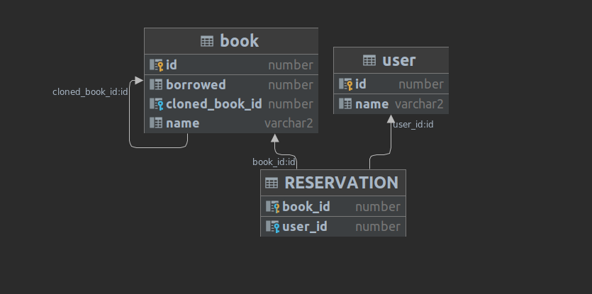
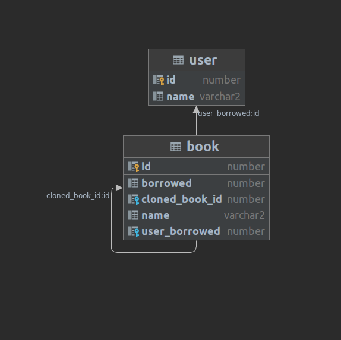

# Data Design
First I decided to make a middle entity for reserving book like this:

BOOk_RESERVATION which contains two fk:
USER_ID(User.id),
BOOK_ID(Book.id)

but then the queries and structure became complicated .

Then I decided to create a list of Book with OneToMany Relation in User entity.
For setting which book can be borrowed I set up a boolean (borrowed) to classify
borrowed and Not borrowed Books(which can be showed in list of library).

Due to existing copy versions of each book, I decided to set a ParentBook which means the original book
that this book is a cloned of that.So Original Book can't have a parent.
Each book can have several copy versions but copy versions should be the copy of just one book. 

# TESTS

Unit and also integration tests will be passed by running tests in 'de.hexad.libmanagement in LibManagement'
also -mvn test

